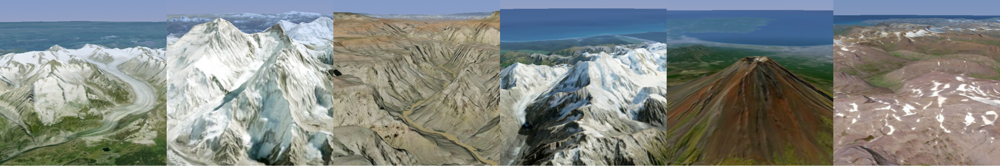

# bachelor-thesis

Implementation of a Real-time Streaming-based Terrain Level of Detail System - Bachelor thesis by Amar Tabakovic at the Bern University of Applied Sciences



## Introduction
Large-scale terrain rendering is fascinating not only from a visual standpoint, but also from a technical one.
For my bachelor thesis, I developed a large-scale terrain renderer with C++ and OpenGL that is able to render
the entire Earth using web-based tile APIs for height data and imagery. Currently, the system is 
based around  
MapTiler's "Satellite V2" and "Terrain RGB V2" datasets, which are rendered by the system up to zoom level 14.

A selection of technical features include:
- Hierarchical terrain LOD based on Chunked LOD
- Efficient rendering with heightmap-displacement and globe projection in the vertex shader
- Skirt meshes for avoiding cracks and pole meshes for filling holes at the North and South Pole due to Web Mercator's latitude cutoff
- Multithreaded streaming of terrain tiles from web APIs (currently only one imagery and height layer)
- LRU-based memory and disk caching of tiles 
- View-frustum culling and horizon culling
- Configurable parameters, such as cache sizes and paths, mesh resolutions, and more

To learn more about this project, feel free to read more about it [here](https://amartabakovic.ch/projects/bachelor-thesis). 

## Used Languages, Libraries and Tools
- C++ 17
- OpenGL 4.0
- CMake
- GLEW
- GLFW
- GLM
- Dear ImGui
- stb_image.h
- libwebp
- libcurl

## Installation and Building
### Required Software
The only requirement for building and running StreamingATLOD is 
that libcurl is installed on your system. All other used 
libraries are built from source. 

### Linux and Mac OS
1. Clone repository
```plaintext
git clone --recursive https://github.com/AmarTabakovic/bachelor-thesis.git
```
2. Change directory and run CMake
```
cd bachelor-thesis/streaming-atlod
mkdir build
cd build
```
3. Run CMake and Make
```
cmake ..
make
```
4. Define configuration file (see below for all options)
5. Run (replace `<config-file>` with the path of your config file)
```
./streaming-atlod <config-file>
```

### Windows
StreamingATLOD was not yet tested on Windows, but it should still work.
Perform the same steps as above (except running make).
Afterwards, you should be able to load the `.sln`
solution in Visual Studio.

## Usage
### Keyboard
- `W`: move forward
- `S`: move backward
- `A`: move left
- `D`: move right
- `Q`: move up
- `Up`: look up
- `Down`: look down
- `Left`: look left
- `Right`: look right
- `E`: move down
- `F`: freeze LOD and culling
- `B`: show AABBs
- `G`: show wireframe
- `Esc`: quit

### Mouse
In order to look around, hold the left mouse button 
and drag it in the direction you want the camera to rotate.

### Configuration Options
StreamingATLOD can be configured in a number of ways.
The below options are mandatory:
- Heightmap service URL: The URL for the heightmap web API. Requires a trailing slash.
- Overlay service URL: The URL for the overlay web API. Requires a trailing slash.
- Heightmap service key: The key for the heightmap web API.
- Overlay service key: The key for the overlay web API.
- Maximum zoom level: The maximum zoom level a terrain node can reach. Limited to between 0 and 30. Setting this value higher than what the APIs can serve risks making unnecessary API requests.
- Memory cache size: The maximum number of elements in the memory cache. Limited to between 100 and 500.
- Disk cache size: The maximum number of elements in the disk cache. Limited to between 400 and 8000. Also, the disk cache capacity must be at least four times the memory cache capacity.
- Disk cache location: The location of the disk cache on the file system. **ATTENTION:** Be careful where you specify your disk cache since unused terrain data gets deleted from the disk over time.
- Number of load workers: The number of load worker threads. Limited to between 1 and 8.
- Low resolution mesh size: The side length of the low resolution terrain mesh. Limited to between 8 and 512.
- Medium resolution mesh size: The side length of the medium resolution terrain mesh. Limited to between 8 and 512.
- High resolution mesh size: The side length of the high resolution terrain mesh. Limited to between 8 and 512.
- Data folder location: The path of the [data](data) folder, which contains the GLSL shader code and skybox images. Requires a trailing slash.

See the [included example](streamingatlod.config) in the repository or here:
```plaintext
diskcachepath=PATH_TO_DISK_CACHE
heightdataserviceurl=https://api.maptiler.com/tiles/terrain-rgb-v2/
overlaydataserviceurl=https://api.maptiler.com/tiles/satellite-v2/
heightdataservicekey=API_KEY
overlaydataservicekey=API_KEY
memorycachesize=400
diskacachesize=8000
lowmeshres=16
mediummeshres=32
highmeshres=64
numloadworkers=5
datapath=../../data/
maxzoom=14
```
